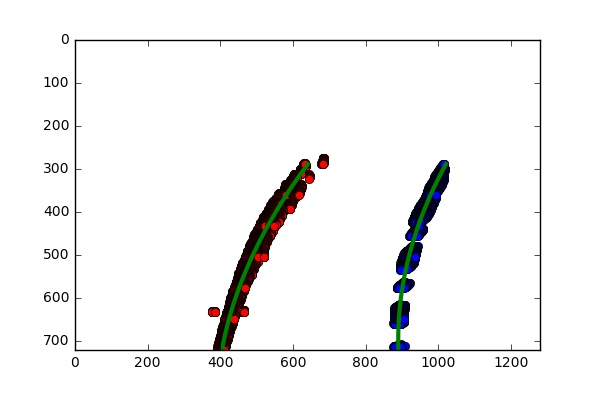

## Advanced Lane Finding


The goals / steps of this project are the following:

* Compute the camera calibration matrix and distortion coefficients given a set of chessboard images.
* Apply a distortion correction to raw images.
* Use color transforms, gradients, etc., to create a thresholded binary image.
* Apply a perspective transform to rectify binary image ("birds-eye view").
* Detect lane pixels and fit to find the lane boundary.
* Determine the curvature of the lane and vehicle position with respect to center.
* Warp the detected lane boundaries back onto the original image.
* Output visual display of the lane boundaries and numerical estimation of lane curvature and vehicle position.

[//]: # (Image References)

[image1]: ./test_images/checker_undistorted.jpg "Undistorted"
[image2]: ./test_images/undistorted_test7.jpg "Road Undistorted"
[image3]: ./test_images/test7_binary.jpg "Binary Example"
[image4]: ./test_images/transform.jpg "Warp Example"
[image5]: ./examples/color_fit_lines.jpg "Fit Visual"
[video1]: ./project_video.mp4 "Fit Visual"

## [Rubric](https://review.udacity.com/#!/rubrics/571/view) Points
###Here I will consider the rubric points individually and describe how I addressed each point in my implementation.  

---

### Camera Calibration

#### 1. Have the camera matrix and distortion coefficients been computed correctly and checked on one of the calibration images as a test?
The code for this step is contained in the second through fourth code cell of the IPython notebook located in "P4-Advanced-Lane-Lines.ipynb".  

The car's camera was calibrated using pictures taken of a chessboard and making use of an OpenCV function called cv2.findChessboardCorners. The function uses a pinhole camera model to discern the lens distortion in the camera by detecting corners within a chessboard and then creating a mathmatical adjustment to straighten the image. 

The following code reads in a series of chessboard images. For each image, the cv2.findChessboardCorners function is called and if the chessboard corners are detected, appends them to a list. The OpenCV function `cv2.calibrateCamera()` uses this list of `objpoints` and `imgpoints` to calculate a calibration matrix by which all future images from the same camera can be undistorted. 

I applied this distortion correction to the test image using the `cv2.undistort()` function and obtained this result: 

![alt text][image1]

### Pipeline (single images)

#### 1. Has the distortion correction been correctly applied to each image?
I applied the distortion correction to one of the images from the video. I chose this image for much of the processing because it was a good straight section of the road and I could get good results from the perspective transformation that follows. 

Below is an undistorted version of the image, using the same process as above for the checkerboad calibration.
![alt text][image2] 
#### 2. Has a binary image been created using color transforms, gradients or other methods?
I created a binary image that took advantage of both gradient and color thresholding. I included this process in a function called `process_image(image)` which takes in the original frame of video or image file, undistorts it using the calibration matrix derived from the camera calibration process, computes the sobel gradient in the x direction, and computes a color thresholded binary image using the saturation channel of the image.

The x-gradient binary image and the binary result of the saturation thresholded image are then combined, selecting all nonzero pixels shared in both images. 

![alt text][image3]

#### 3. Has a perspective transform been applied to rectify the image?

The code for my perspective transform then takes the binary image and warps the perspective to create a top-down view (this can be found in the 3rd code cell of the IPython notebook). 

I chose to manually pick source (`src`) and destination (`dst`) points.  My harcoded `src` and `dst` points are as follows:

```
src = np.float32([(606,450), (675,450), (1054,680), (327,680)]) 
dst = np.float32([[x_offset, y_offset], 
                  [img_size[0]-x_offset, y_offset], 
                  [img_size[0]-x_offset, img_size[1]-y_offset], 
                  [x_offset, img_size[1]-y_offset]])

```
This resulted in the following source and destination points:

| Source        | Destination   | 
|:-------------:|:-------------:| 
| 606, 450      | 400, 0        | 
| 675, 450      | 880, 0        |
| 1054, 680     | 880, 720      |
| 327, 680      | 400, 720      |

I verified that my perspective transform was working as expected by drawing the `src` and `dst` points onto a test image and its warped counterpart to verify that the lines appear parallel in the warped image.

Another step I included was to mask the image a bit likewe did in the first project. 

The following image shows the original straigefig('foo.png' ht road image, how it was masked using a "region of interest" and the resultant warped image. This is just to illustrate the transform. In the actual pipeline, the transformation happens to the binary image. I will show that below, using a more curved section of road. 

![alt text][image4]

#### 4. Have lane line pixels been identified in the rectified image and fit with a polynomial?

I created a function called `create_lane_lines()` that takes an image (or a frame of video) and returns an image with extrapolated lane lines. The steps this function takes are as follows: 
1. Processes the original image (with gradients and color thresholds) to create a binary image.
2. Masks the image with a "region of interest".
3. Warps the image to create a top-down view.
4. A histogram is computed for the image to initialize the initial position of lane lines. 
5. A sliding window approach is taken to travel the image and find pixels for each lane. 
6. These points are added to arrays and a second order  polynomial is fit to the points to create a curved model of the lane line. 
7. These lines are used to fill a polygon that represents the lane. The image is re-projected back to its original perspective.

Solarized dark             |  Solarized Ocean
:-------------------------:|:-------------------------:
  |  


The final result (with annotations for curvature and center) like this:

![alt text][image5]

####5. Having identified the lane lines, has the radius of curvature of the road been estimated? And the position of the vehicle with respect to center in the lane?

Yep, sure did!

---

###Pipeline (video)

####1. Does the pipeline established with the test images work to process the video?

It sure does!  Here's a [link to my video result](./project_video.mp4)

---

###README

####1. Has a README file been included that describes in detail the steps taken to construct the pipeline, techniques used, areas where improvements could be made?

You're reading it!


---
##Discussion

Here I'll talk about the approach I took, what techniques I used, what worked and why, where the pipeline might fail and how I might improve it if I were going to pursue this project further.  